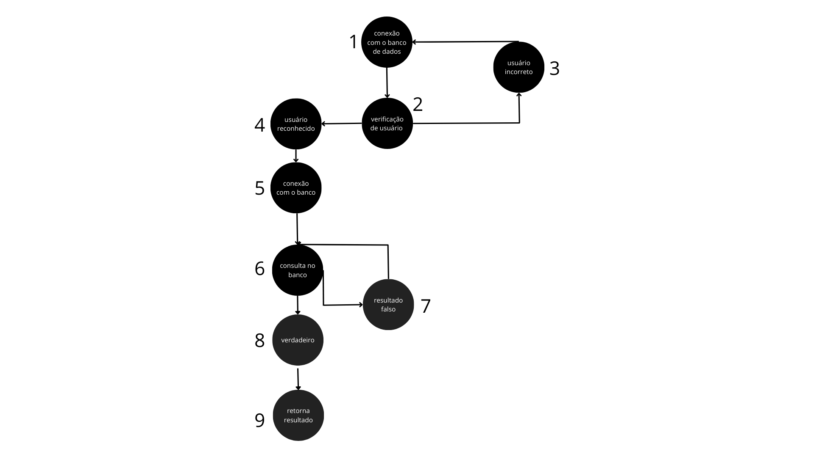

## Teste-Caixa-Branca

Este repositório é um exercício da matéria de Qualidade e Testes de Software.

## Métodos
O código contém duas classes: Main e User. Por ser apenas uma conexão com banco de dados hipotética, o foco será apenas na classe User. É possivel observar que ela contém 2 metódos: um para conectar ao banco de dados (conectaBD()) e um para verificar se as credenciais do usuário estão corretas ou existem no banco (verificarUsuario())

## Avaliação
1. A documentação não foi descrita no código.
  
2. Os nomes de algumas variáveis no código não são claros, dificultando a compreensão do propósito e do conteúdo de cada variável. Nomes mais descritivos e significativos tornariam o código mais legível e facilitariam a manutenção.
  
3. O código está bagunçado, com falta de espaços e organização, o que o torna difícil de ler. Um exemplo é a parte da query SQL no código, que está desorganizada devido à falta de espaços, identação e concatenação de strings, tornando ela difícil de ler e propensa a erros. Melhorar a estrutura do código aumentaria a legibilidade e reduziria erros.

4. O código não parece tratar adequadamente  NullPointer. É importante adicionar tratamento para esses casos para evitar possíveis erros inesperados.

5. A arquitetura não foi bem definida.

6. Não. A falta de fechamento de conexões pode resultar em esgotamento de recursos, impedindo novas conexões e afetando o aplicativo/app. Além disso, pode causar problemas de segurança, como exposição de informações sensíveis em conexões não encerradas.

## Adicional

7. Os blocos "catch" vazios no código não tratam adequadamente os erros, tornando difícil identificar e resolver problemas, comprometendo a confiabilidade do programa. É importante adicionar tratamento de erros apropriado para lidar melhor com falhas.

## Grafo

V(G) = 02 REGIÕES.
V(G) = 10 ARESTAS.
V(G) = 09 NÓS.
CÁLCULO: V(G) = (ARESTAS – NÓS) + 2

Cálculo: V(G) = (10 - 09) + 2 = 3

## Sequências

* 1;2;3;
* 1;2;4;5;6;7;
* 1;2;4;5;6;8;9;

  
## Etapa 3
Foram adicionados comentários no código para documentar o mesmo. A documentação de código é importante para explicar de forma clara o que um programa faz, como ele funciona e como as pessoas podem usá-lo. Isso ajuda os programadores a entenderem o código, torna mais fácil trabalhar juntos e possibilita usar o código novamente em outros projetos.
